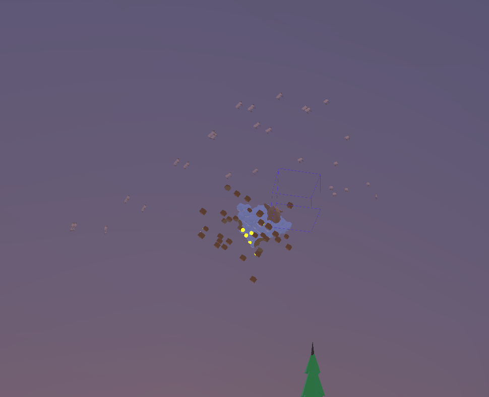

# Sheep Terrarium
Name: Aidan Dowling
Student Number: C20394933
Name: Aleksey Makarevich
Student Number: C20402732
Name: Matthew Tweedy
Student Number: C20381946
Name: Finn Maguire
Student Number: C20492576

Class Group: TU856/4

## Video:

## Screenshots
| Feature | Image |
|-----------|-----------|
| Main Menu |  |
| Realistic Shark-like Behaviour |  |
| Boid Infometer |  |
| Hypno Toad |  |
| Sheep Rapture |  |
| Sheep Heaven |  |
| Sheep Head Trippy |  |

# Instructions
| Action | KeyBind |
|-----------|-----------|
| Walk Forward | W |
| Walk Left | A |
| Walk Right | D |
| Walk Backward | S |
| Jump | (Space) |
| Spawn New Sheep | ] |
| Kill Targeted Sheep | X |
| Kill All Sheep | G |
| Set / Clear Sheep Target | Right Mouse Button |
| Quit | Q |

# How it works
Heavily modified version of the "minature-rotary-phone" repo, demoing behaviours of Sheep, and Shark (a well known common enemy), aswell as exploring the themes of Sheep and their revernce of god.

# List of classes/assets
| Class/asset | Source |
|-----------|-----------|
| Boid.gd | Self written (inspired by class Boid code) - Aidan Dowling|
| Sheep.gd | Self written - Aidan Dowling|
| Shark.gd | Self written - Matthew Tweedy|
| DayNightCycle.gd | Self written - Finn Maguire|
| EnvController.gd | Self written - Finn Maguire|
| WaterCollision.gd | Self written - Finn Maguire and Aidan Dowling|
| BoidController.gd | Self written - Aidan Dowling|
| BoidDetector.gd | Self written - Aidan Dowling|
| BoidInfometer.gd | Self written - Aidan Dowling|
| BoidSoundPlayer.gd | Self written - Aidan Dowling|
| GodCloud.gd | Self written - Aleksey Makarevich|
| GodHead.gd | Self written - Aleksey Makarevich|
| MainMenu.gd | Self written - Aidan Dowling|
| Escape.gd | Implemented from algorithm described in [this paper](https://www.diva-portal.org/smash/get/diva2:1354921/FULLTEXT01.pdf) - Aidan Dowling |
| Cohesion.gd | Implemented from algorithm described in [this paper](https://www.diva-portal.org/smash/get/diva2:1354921/FULLTEXT01.pdf) - Aidan Dowling |
| Alignment.gd | Implemented from algorithm described in [this paper](https://www.diva-portal.org/smash/get/diva2:1354921/FULLTEXT01.pdf) - Aidan Dowling |
| Separation.gd | Implemented from algorithm described in [this paper](https://www.diva-portal.org/smash/get/diva2:1354921/FULLTEXT01.pdf) - Aidan Dowling |
| SharkConstrain.gd | Self written -Matthew Tweedy |
| Grazer.gd | Self written -Aidan Dowling |
| grass.gd | Self written -Aidan Dowling |
| SpatialHashing.gd | Implemented from [this 2009 blog post](https://conkerjo.wordpress.com/2009/06/13/spatial-hashing-implementation-for-fast-2d-collisions/) - Aidan Dowling |
| spawn_zone.gd | Self written - Aidan Dowling |
| hypno_toad.gd | Self written - Finn Maguire |
| explosion_particles.gd | Self made - Aleksey Makarevich |

# List Models / Shader Resources
| Asset | Source |
|-----------|-----------|
| heat.gdshader | Self written - Finn Maguire |
| water.gdshader | Self written - Finn Maguire |
| waterfall.gdshader | Self written - Finn Maguire |
| env_control | Self written - Finn Maguire |
| Sheep.gltf/blend | Self made - Aleksey Makarevich |
| Terrain.gltf/blend  | Self made - Aleksey Makarevich |
| Cloud1.gltf/blend  | Self made - Aleksey Makarevich |
| Cloud2.gltf/blend  | Self made - Aleksey Makarevich |
| GodCloud.gltf/blend  | Self made - Aleksey Makarevich |
| HypnoToad.gltf/blend  | Self made - Aleksey Makarevich |
| Jar.gltf/blend  | Self made - Aleksey Makarevich |
| Tree.gltf/blend  | Self made - Aleksey Makarevich |
| explosion_particles.tscn | Self made - Aleksey Makarevich |
| Shark.gltf/blend  | Self made - Matthew Tweedy |
| psy.gdshader | Self written - Finn Maguire |
| Blood_splatter.tscn  | Implemented from [this video](https://youtu.be/KEcyDD8QtGA?si=PFcKC3R6qJ1toGWa) - Matthew Tweedy |
| blood.tres  | Implemented from [this video](https://youtu.be/KEcyDD8QtGA?si=PFcKC3R6qJ1toGWa) |
| blood_spot.tres  | Implemented from [this video](https://youtu.be/KEcyDD8QtGA?si=PFcKC3R6qJ1toGWa) - Matthew Tweedy |

# List of Music / Audio Resources
| Asset | Source |
|-----------|-----------|
| sheep_music.mp3 | Self written original piece of music (recorded performed and mixed by Aidan Dowling) |
| sheep song.mp3 | Cover of the Halo Theme Song (recorded, performed and mixed by Aidan Dowling - additional vocal samples from Matthew Tweedy)  |
| explosion_01.mp3 | Self created and recorded sound effect - Aidan Dowling |
| sheep-baa-GOD.mp3 | Self created by Matthew Tweedy |
| sheep.mp3 | Self created by Matthew Tweedy  |
| angel_sound_effect.mp3 | Classic audio from [here](https://www.youtube.com/watch?v=7VHbSCJyxyE) |
| sheep-baaX.mp3 | All credits to [freesound.org](freesound.org) |

We drove out to the Dublin mountains and took photos of wild life. These can be found [here](https://drive.google.com/drive/folders/1uMXFN536_LZ9J_W-HKQTxbd4fv9Z8X_I?usp=drive_link). We noticed that the sheep were elusive and hard to capture images of - this inspired by the "Escape" behaviour.

## Aidan Dowling (C20394933)
I did general project management / team leading and lead programming on this project. I abstracted the interactions of the boid classes to a parent class, reimplementing how those classes interact with eachother and the boid controller. I rewrote the boid controller to utilize dictionaries to manage different types of boids existing at the same time. This reduces unnecessary checks over boids which are irrelavant. I also reimplemented bucket based spatial hashing, which allows for more efficient boid neighbour detection. I added a sound system to the behaviours, which then determine if a sound is played by the sheep, with cooldowns and sounds from larger forces being chosen. I created the BoidInfometer which displays information about the boid you are looking at, such as its name, health, hunger and the current behaviours affecting it. I also wrote an original soundtrack for the game and recorded a cover for the main menu. The original sound track was heavily inspired by ambient electronic musicians (such as C418, Aphex Twin), and was recorded within Ableton.  

I am most proud of two things - the capable abstractions of boid's which allows dynamic interactions and the sound design and the audio system - music smoothly fades and loops, and sheeps have a dynamic sound effects depending on the behaviour exhibited.

I learned a lot about writing code within Godot and its unique paradigms. I learned how to do audio in Godot and mixing audio for games. I learned a huge amount about boid behaviours and the process of implementing those things in a collaborative environment. 

## Aleksey (C20402732)
I did the bulk of the model creation for the project. This was done due to me having the most modeling experience out of the group. This included creating the low-poly models, texturing them, rigging them and animating them. After this was done i worked on implementing the moving godsheep. This gave a way for the sheep to reproduce and to be blessed if the shepard was well behaved. 

I am most proud of two things - the look and feel of the enviroment and the un-natural feeling of the moving godsheep

I broadened by knowledge in using blender as i had never done animation before, learning about keyframing and how to output these animations into godot. 

# Addons Used

NOTE:  Addons are not included in the repo and must be installed manually to run.

[DebugDraw3D](https://godotengine.org/asset-library/asset/1766)

# Sound Sources
Evanescence (Cover by @gemmaljohnston on tiktok) - Bring Me To Life

Halo Theme Song Notes - William Joseph & Lindsey Stirling

Sheep Baa Sound effects - freesound.org

# References
Blood Particles - https://youtu.be/KEcyDD8QtGA?si=PFcKC3R6qJ1toGWa
